## Project: 3D Motion Planning

### Explain the Starter Code

#### 1. Explain the functionality of what's provided in `motion_planning.py` and `planning_utils.py`

`motion_planning.py` uses a similar state machine implementation as the Backyard Flyer. It does add a planning state before take off. In the planning phase the program will first determine it's location and set the goal then it will execute a path finding algorithm to generate a list of waypoints. After planning the drone will take off and then use the waypoints to fly to the goal. 

`planning_utils.py` provides functions to create the 2.5D grid and a A* implementation. The Action class and `valid_actions` method were extended to support diagonal steps. 

A* is a search algorithm that will extend the partial plan with the lowest expected cost. The expected cost is calculated as the sum of the actual cost of executing the partial plan and the value of a heuristic function which represents a lower bound of the remaining cost to the target. The implementation uses euclidean distance as heuristic function.  

The `Action` class represent the allowed action with the associated cost and the `valid_actions` method returns the list of available actions given a grid and a current position. It basically needs to check that the action you will perform doesn't take the drone outside of the grid or run it into an obstacle.

### Implementing Your Path Planning Algorithm

All Todo's were implemented in `motion_planner.py` and `planning_utils.py` for a global planning approach using the Medial Axes method. 

I also implemented a local planning approach which will be described later on. This approach can be found in the files: `planning_engines.py` and `motion_planning_with_local_planning.py`. But more about this later. 

#### 1. Set your global home position

The `colliders.csv` file contains the global home position. The `planning_engines.get_global_home` method opens the file and reads the relevant values from the first line. Initially the colliders.csv file had the lat/lon values on the second line, but after the update of the file it slightly changed. I kept the code to read the original file format in comments in case you need to switch back. 

```
def get_global_home(filename):
    with open(filename) as f:
        # used on initial colliders.csv file
        # h = f.readline()
        # lat, lon = [float(x) for x in f.readline().split(',')]
        # slightly different format in first lines of colliders.csv
        lat, lon = [float(x.replace("lat0 ", "").replace("lon0 ", "")) for x in f.readline().split(',')]
        global_home = np.array([lon, lat, 0.0])
    return global_home
```

#### 2. Set your current local position

The Drone api provides a `set_home_position` method to set the home position:

```
self.set_home_position(global_home[0], global_home[1], global_home[2])
```

#### 3. Set grid start position from local position

The `frame_utils` module provide the `global_to_local` method to calculate the NED coordinates from he global position (and the global home position as reference).

```
current_local_pos = global_to_local(self.global_position, global_home)
```

#### 4. Set grid goal position from geodetic coords

You can set the goal positions in the `plan_path` method. 

```
goal_lon, goal_lat = -122.4081522, 37.7942581
```
 
#### 5. Modify A* to include diagonal motion (or replace A* altogether)

I extended the the Action class with NE, NW, SE and SW directions. Each has a cost of sqrt(2). The `valid_actions` method is also extended to make sure these actions don't move outside of the grid or hit an obstacle. 

For the global waypoints, I use the (inverted) Medial Axis skeleton as the grid. This reduces the search space significantly, making the global planning step quite fast. 

I preferred this approach because in the exercises I found the probabilistic mapping approach quite slow. Especially because a high number of samples were necessary to get sufficient coverage over the search space to actually be able to find a path to the target.

#### 6. Cull waypoints 

To reduce the number of waypoints, I first use the collinearity method implemented in the exercises to remove all collinear points. see `planning_engines.collinearity_check` for details. 

I noticed that the Medial Axis skeleton was not very linear through the bigger streets. I implemented a raytracing method to get straight paths. The method is implemented in `planning_engines.prune_path_using_raytracing`. It is a recursive approach that will check if there is a clear path between the first and last point of the path. if so, the path can be reduced to these 2 points. if not, then the path is split in the middle and the method is applied to both sides. This method reduces the a lot of waypoints. To determine whether the path is clear, the `bresenham` method is use get the points along the path and each of them is checked on the grid for obstacles.

Example from logs of the path shown in the chapter section:

```
North offset = 316, east offset = 445
Local Goal: {0}
Local Start and Goal:  (210, 719) (385, 332)
Found a path.
number of waypoints: 546
number of waypoints after collinearity pruning: 201
number of waypoints after raytracing pruning: 16
```


### Execute the flight

After integrating the code, I ran a few test paths to check if executing a global plan worked. 

Below plot shows the calculated waypoints (blue dots) and the actual path flown by the drone in the VM environment for target [37.7931154, -122.398721](https://www.google.be/maps/place/37%C2%B047'35.2%22N+122%C2%B023'55.4%22W/@37.7930315,-122.3995477,18.19z/data=!4m5!3m4!1s0x0:0x0!8m2!3d37.7931154!4d-122.398721?hl=en)

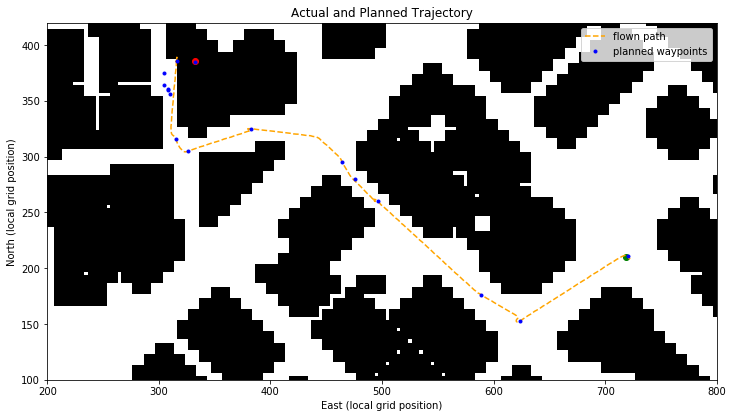

The flown path was plotted by using the TLog.txt file after flying the actual path in the simulator. You can find the code to generate this and more plots in the `global_planning.ipynb` notebook. 


#### Improvements

This implementation does require a goal that is actually reachable. I didn't add any logic to handle an unreachable location. 
  
# Extra Challenges: Receding Horizon

I also implemented a Receding Horizon approach. I went for a Voxel Map approach because I believed adding vertical movement would be a nice fit for obstacle avoidance during flight and maybe I just wanted to see more action in the altitude graphs.

In _Implementation Details_ I describe how the local planning phase is integrated in the state machine of the flight computer. Then I go into more details on how the actual local planner works in _Local Planning Example_. The _Results_ section shows the results of an actual flight in the simulator using the local planning approach and I finish up with an _Evaluation_ off the results. 

## Implementation Details

I created a separate implementation for the local planning approach which can be run as follows: 

```
source activate fcnd
python motion_planning_with_local_planning.py
```

The state machine now contains a new State LOCAL_PLANNING. It is executed for the first time after planning and take off. In each local planning phase, the `update_position` method in `planning_engines.Local3DPlanner` is called. This will trigger a new local 3D view to be extracted and a new local target to be set. The `plan` method is then called to execute an A* search on the 3D space to find a path. The same collinearity test is applied to prune the resulting path. 

A* implementation details (all located in the `planning_engines` module):

| method / class | Description
| -------- | --------
| Action3D  | for now I just added vertical movements UP and DOWN
| valid_3d_actions  | copy of the original function but with support for Action3D 
|  a_star_3d | copy of original A* function but it uses `Action3D` and `valid_3d_actions`

If a local path can't find a path to its local goal, the state machine goes back to PLANNING phase to trigger a global re-planning. 

If it can find a local path, the state machine goes into WAYPOINT phase and will fly along the local path. If the all local waypoints are reached, the state machine goes back into LOCAL_PLANNING mode. The current location is used to call the `update_position` method again to start the local planning process again. 

If the local planner doesn't have any more global waypoints to fly to, the state machine will move to LANDING phase. 

## Local Planning example

Here is an example of a local planning step. The data is not from an actual flight in the simulator, but generated to test the algorithm (see the "End to End Local Planning" section in `local_planning.ipynb` ). The results of traversing the full path are added at the end of this document.

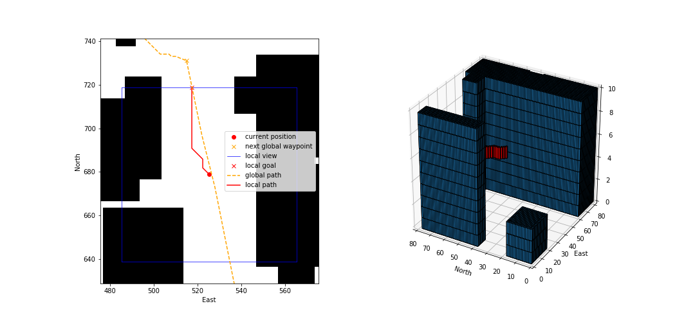

The 2D view shows how the local goal is set on the border of the current view in the direction of the next waypoint. Any waypoints inside the local view are skipped. 

Once a local target is set an A* search is executed on the 3D voxel map. The red lines in both the 2D and 3D plots show the local path. 

I used a voxel size of 1 to get finer resolution, but you can already see that discretising the map leads to unnecessary waypoints. 

To traverse the full path (outside of the simulator), I just set the last local waypoint as the current position and generate the next local view. This allowed me to validate the algorithm before integrating it into the drone. The results can be found in "Appendix A: End to End Local Planning Steps" below.

## Results

After integrating the local planner in `motion_planning_with_local_planner.py`, I ran a few test flights. This is an example of a path flown from the map center to towards the trees to the North of the map.

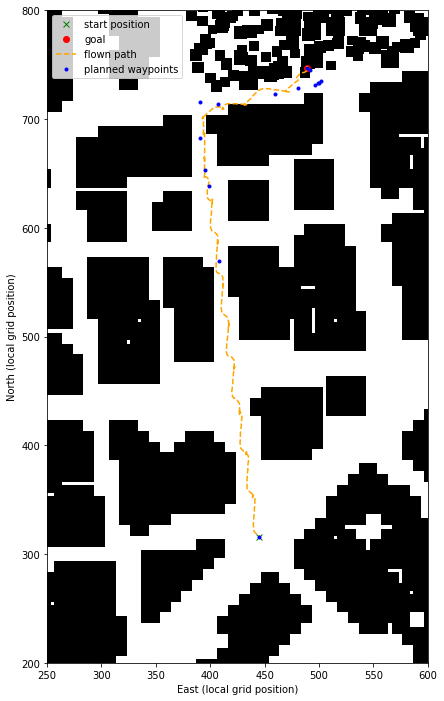

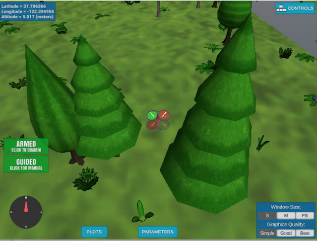

## Evaluation 

The current local planner has some major issues. I'll try to discuss them briefly in this section.

The Local planning step is too slow and can cause the drone to halt during flight. To reduce the search space, I already set a maximum altitude on the voxel map. 

There overall path also isn't very good. On the longer North bound street, you can see the drone swirling around. This is to be expected on a discrete grid because we can only move straight or diagonally across the grid. Increasing the resolution of the 3d grid could reduce this effect, but given the planning step is already too slow this is not really an option.

Overall I think it was a good exercise and at least I have the framework of a local planner implemented, but probably the Voxel Map is not the best approach for local planning. 

Seeing that the global Medial Axis plan already gives a very good path, I believe it makes sense to limit the local planning step to object avoidance. 

This would work something like this. The drone would actually fly towards the global waypoints and the local planning step would only interrupt this path if it found an obstacle along the global path in the current view. To implement this I would need a (fast) 3D raytracing algorithm to check for obstacles along the current path and some more time of course.  

# Appendix 

## Appendix A: End to End Local Planning Steps

Generated plots from evaluating the local planning code (see the "End to End Local Planning" section in `local_planning.ipynb` )

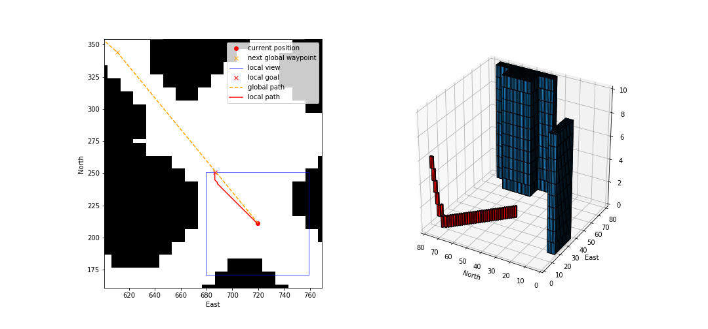

In the code, the starting altitude was set to 0. The resulting local path drags the drone across the surface before lifting off. This obviously wouldn't work in real life. In the integrated code, the local planning phase is executed after take off so this wouldn't occur there.

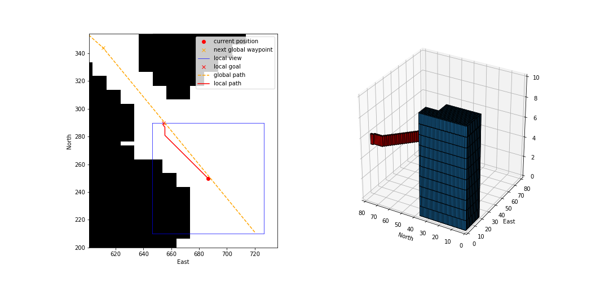

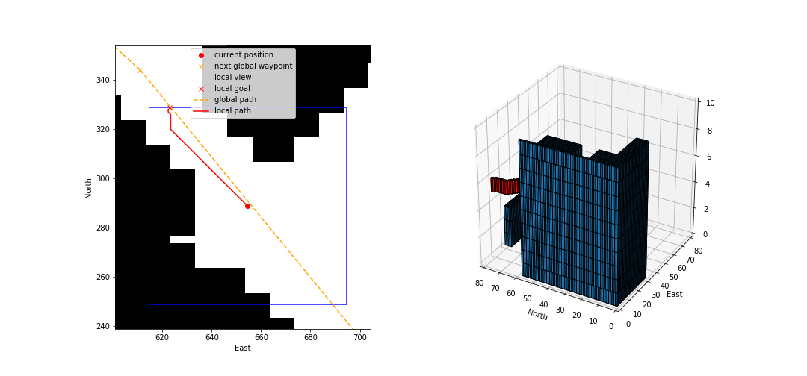

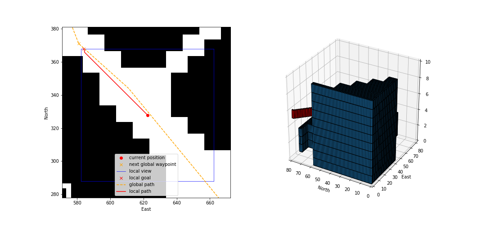

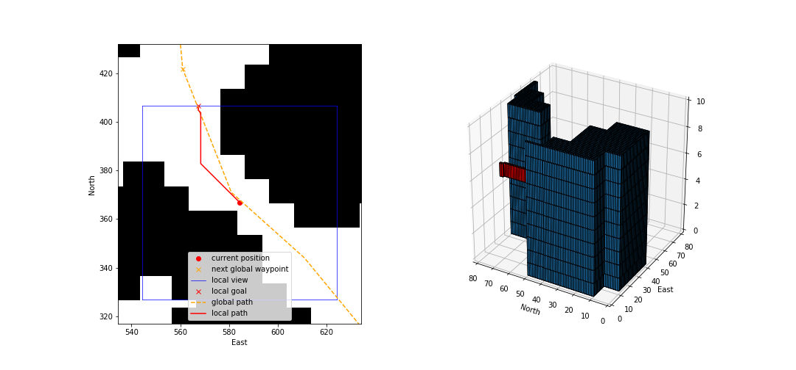

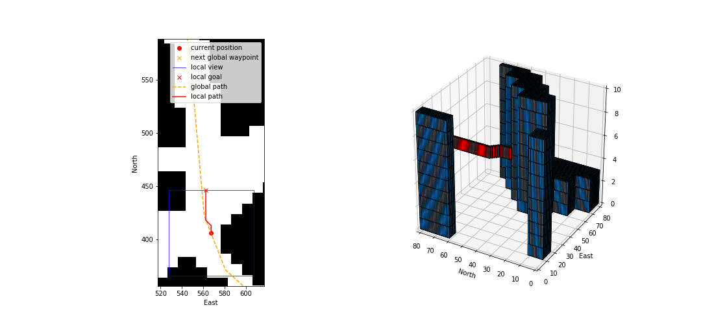

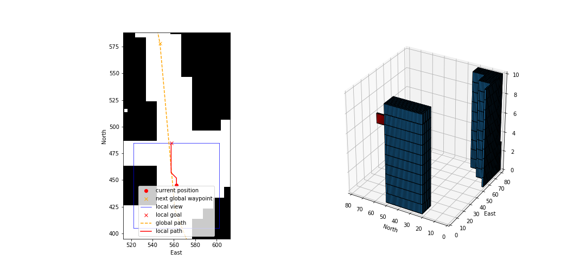

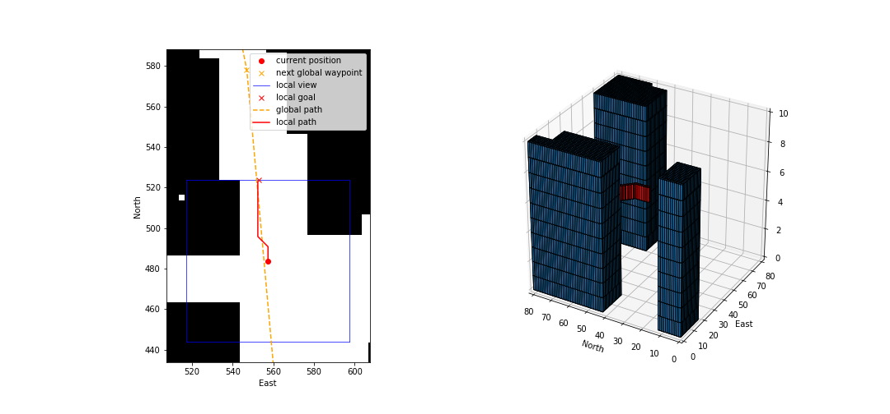

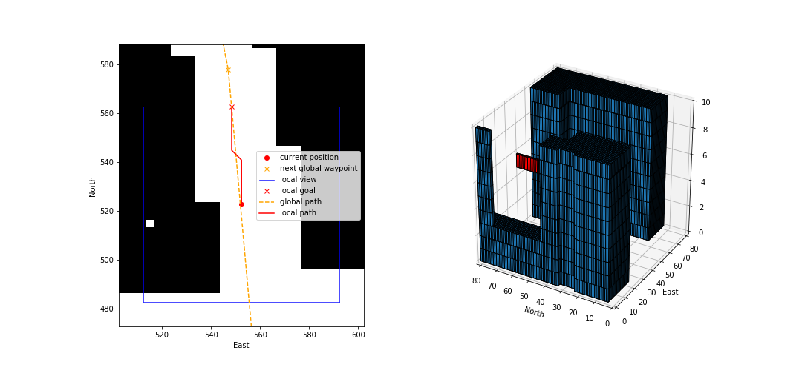

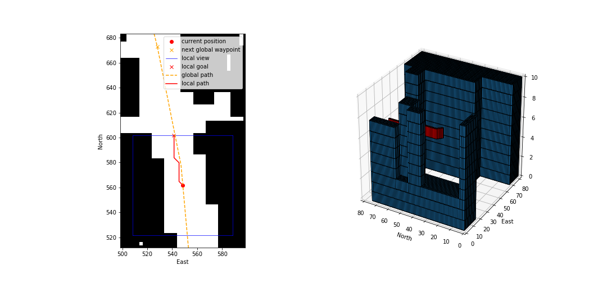

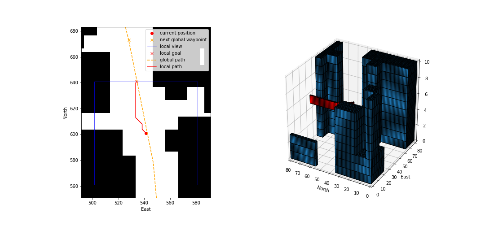

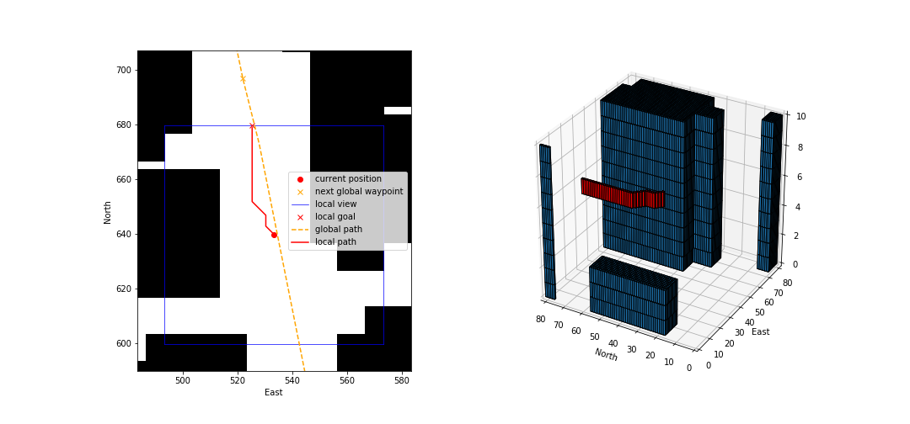


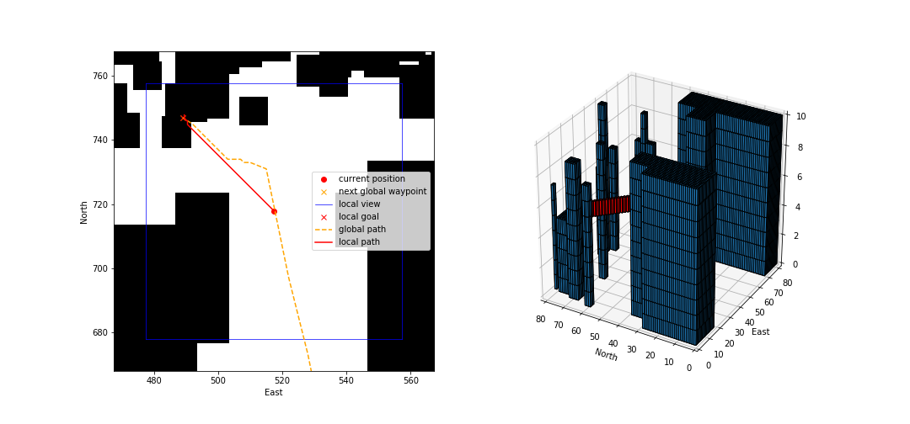